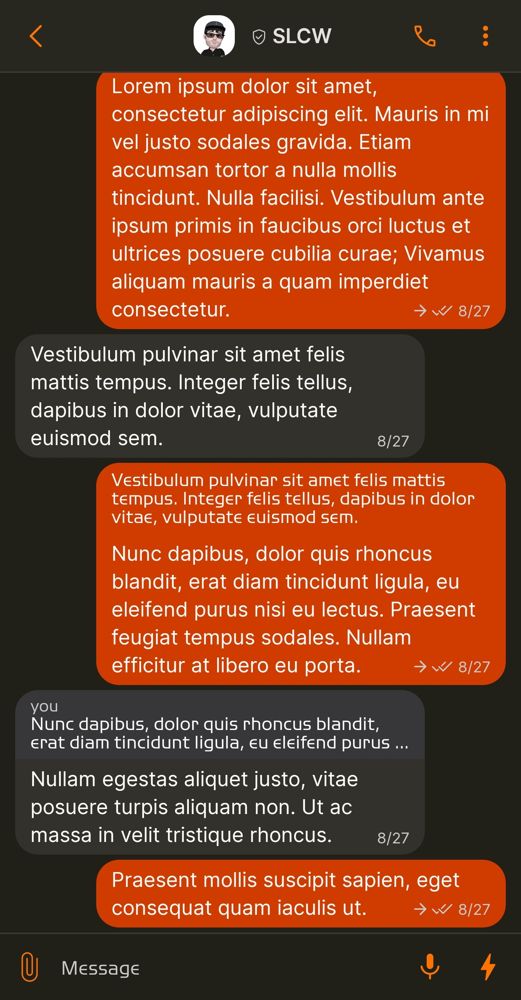
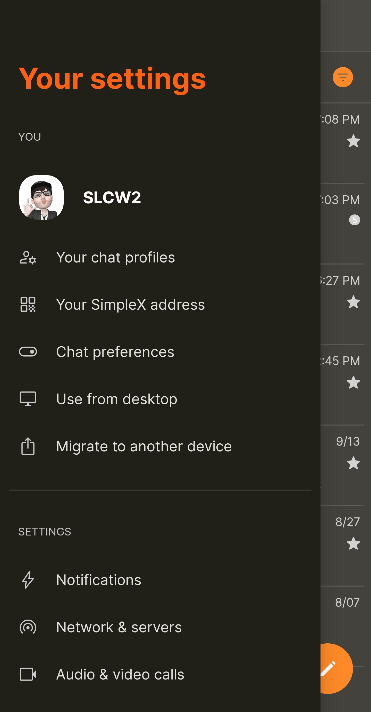
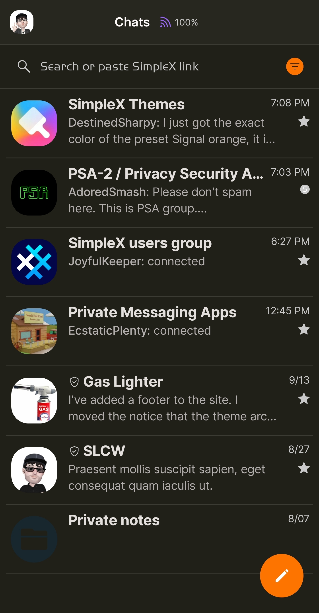
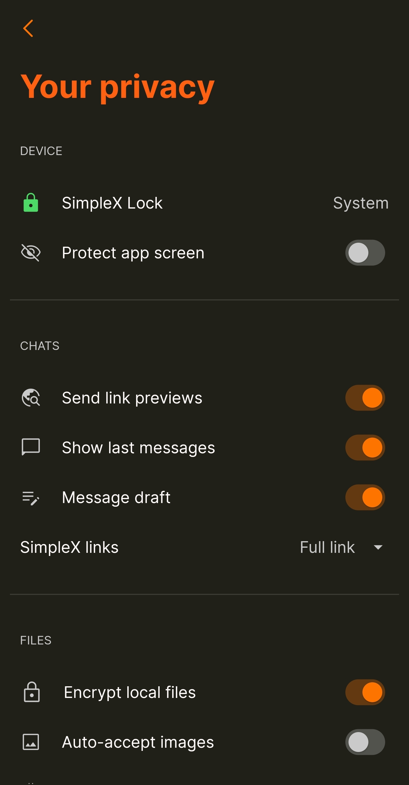

# No AMOLED

* Download [No AMOLED](../themes/SxC_noAMOLED.theme)

<a href="../screenshots/SxC_noAMOLED01.jpg" target="_blank">
		
</a>&nbsp;&nbsp;&nbsp;
<a href="../screenshots/SxC_noAMOLED02.jpg" target="_blank">
		
</a>
<br>
<a href="../screenshots/SxC_noAMOLED03.jpg" target="_blank">
		
</a>&nbsp;&nbsp;&nbsp;
<a href="../screenshots/SxC_noAMOLED04.jpg" target="_blank">
		
</a>

----
### Theme Properties
```
base: "DARK"
colors:
  accent: "#feff7400"
  accentVariant: "#fff27e00"
  secondary: "#ffcacaca"
  secondaryVariant: "#ff5d5e5f"
  background: "#ff201f18"
  menus: "#fe171615"
  title: "#ffff6113"
  accentVariant2: "#ff18262e"
  sentMessage: "#ffd03c00"
  sentReply: "#ffd03c00"
  receivedMessage: "#20b1b0b5"
  receivedReply: "#ff373739"
```

* [Return Home](../)