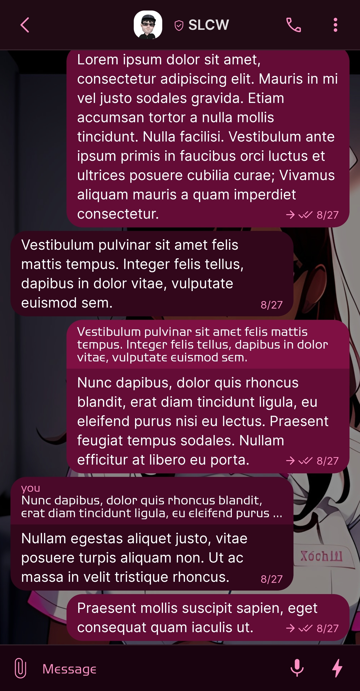
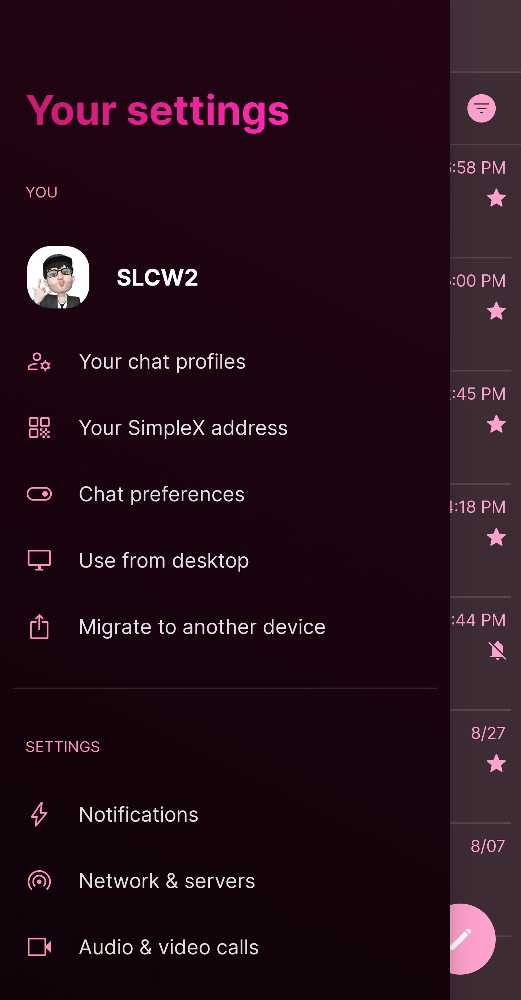
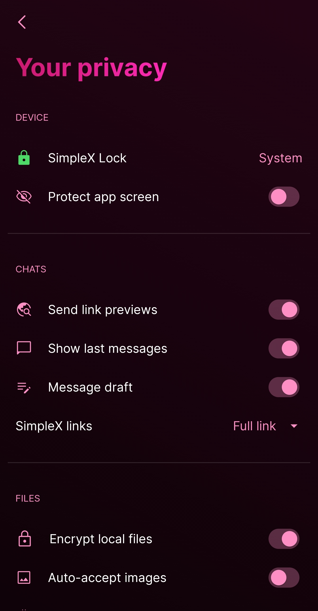

# Nurse Xochitl

* Download [Nurse Xochitl](../themes/SxC_nurseXochitl.theme)

<a href="../screenshots/SxC_nurseXochitl01.jpg" target="_blank">
		
</a>&nbsp;&nbsp;&nbsp;
<a href="../screenshots/SxC_nurseXochitl02.jpg" target="_blank">
		
</a>
<br>
<a href="../screenshots/SxC_nurseXochitl03.jpg" target="_blank">
		
</a>&nbsp;&nbsp;&nbsp;
<a href="../screenshots/SxC_nurseXochitl04.jpg" target="_blank">
		
</a>

----
### Theme Properties
```
base: "SIMPLEX"
colors:
  accent: "#fffd8fc4"
  accentVariant: "#fffb1f88"
  secondary: "#fffd8fc4"
  secondaryVariant: "#ff4401e7"
  background: "#ff19030e"
  menus: "#ff4401e7"
  title: "#fffb1f88"
  accentVariant2: "#fffb1f88"
  sentMessage: "#ff640c36"
  sentReply: "#ff7e1044"
  receivedMessage: "#ff32061b"
  receivedReply: "#ff4b0929"
wallpaper:
  scale: 1.0
  scaleType: "fill"
  background: "#ff000000"
  tint: "#70000000"
```

* [Return Home](../)