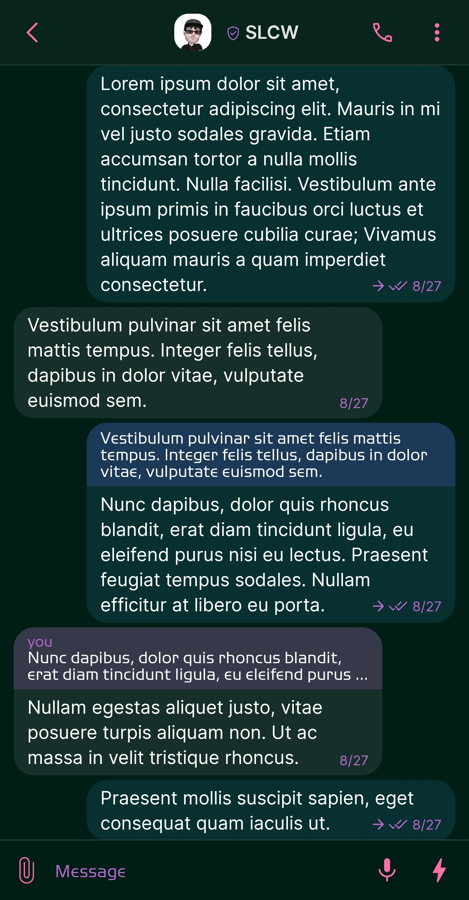
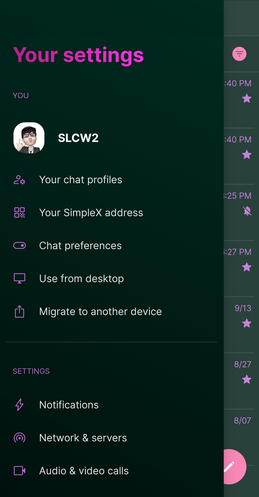
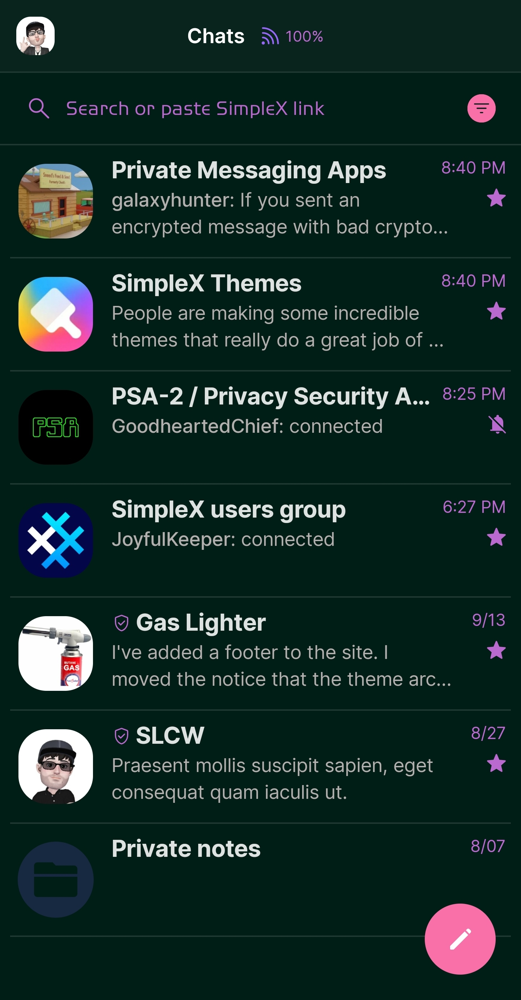
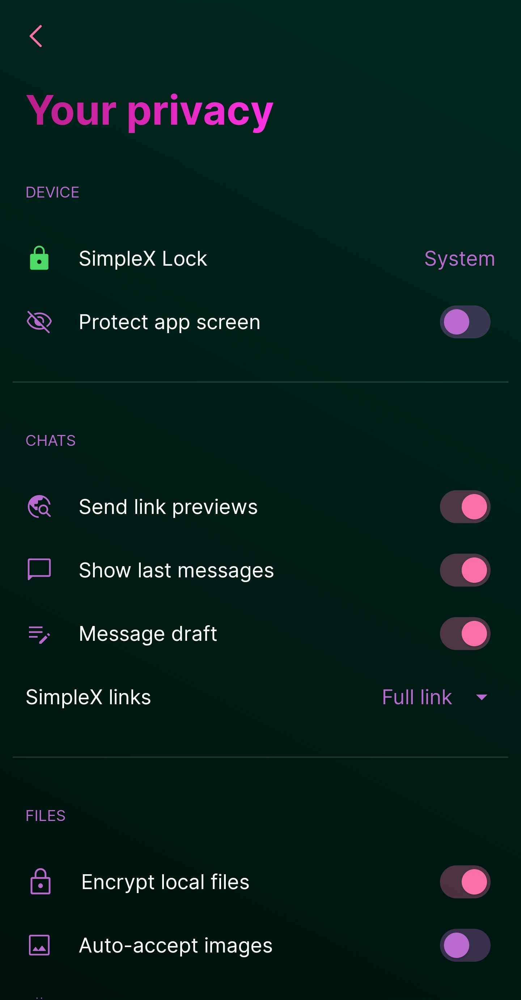

# Pink Panther 

* Download [Pink Panther](../themes/SxC_pinkPanther.theme)

<a href="../screenshots/SxC_pinkPanther01.jpg" target="_blank">
		
</a>&nbsp;&nbsp;&nbsp;
<a href="../screenshots/SxC_pinkPanther02.jpg" target="_blank">
		
</a>
<br>
<a href="../screenshots/SxC_pinkPanther03.jpg" target="_blank">
		
</a>&nbsp;&nbsp;&nbsp;
<a href="../screenshots/SxC_pinkPanther04.jpg" target="_blank">
		
</a>

----
### Theme Properties
```
base: "SIMPLEX"
colors:
  accent: "#fff970a9"
  accentVariant: "#ffd27edc"
  secondary: "#ffba6acf"
  secondaryVariant: "#ff2c464d"
  background: "#ff001d16"
  menus: "#ff121c37"
  title: "#ffe526aa"
  sentMessage: "#1e45b8ff"
  receivedMessage: "#20b1b0b5"
```

* [Return Home](../)