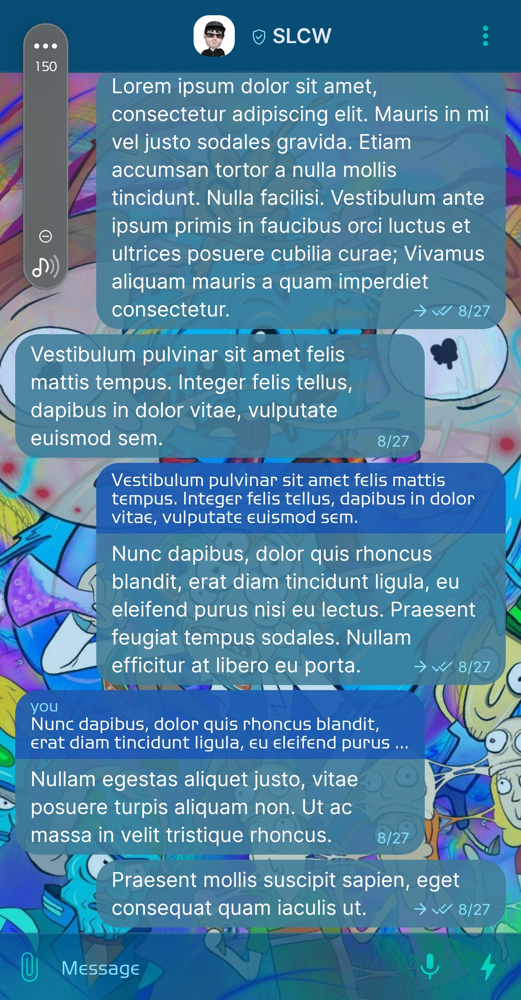
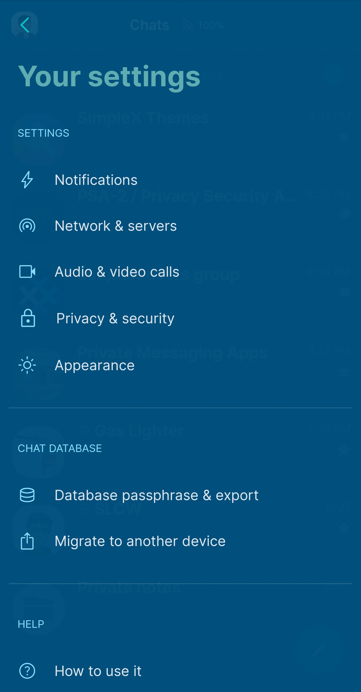
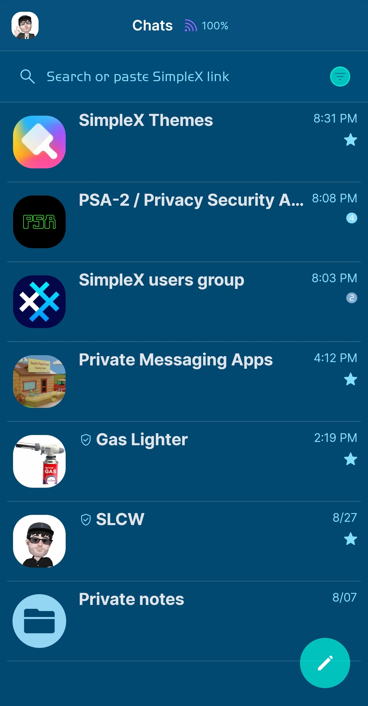
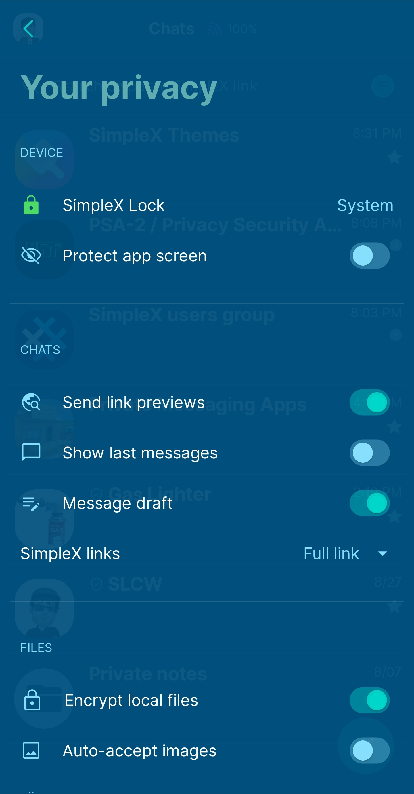

# PsychedeRick 

* Download [PsychedeRick](../themes/SxC_psychedeRick.theme)

<a href="../screenshots/SxC_psychedeRick01.jpg" target="_blank">
		
</a>&nbsp;&nbsp;&nbsp;
<a href="../screenshots/SxC_psychedeRick02.jpg" target="_blank">
		
</a>
<br>
<a href="../screenshots/SxC_psychedeRick03.jpg" target="_blank">
		
</a>&nbsp;&nbsp;&nbsp;
<a href="../screenshots/SxC_psychedeRick04.jpg" target="_blank">
		
</a>

----
### Theme Properties
```
base: "BLACK"
colors:
  accent: "#a900ffe2"
  accentVariant: "#e28cb8df"
  secondary: "#f988e2ff"
  secondaryVariant: "#d31d3cca"
  background: "#ad00507d"
  menus: "#cc00507d"
  title: "#e769b6b6"
  accentVariant2: "#f996d8f6"
  sentMessage: "#e0407c99"
  sentReply: "#800040c8"
  receivedMessage: "#e0407c99"
  receivedReply: "#800040c8"
wallpaper:
  scale: 1.0
  scaleType: "fill"
  background: "#ff000000"
  tint: "#3f007dc3"
```
----
### Credits
Art credits — _alisa.inks (Insta), @stopdotcom (Twitter)_

* [Return Home](../)