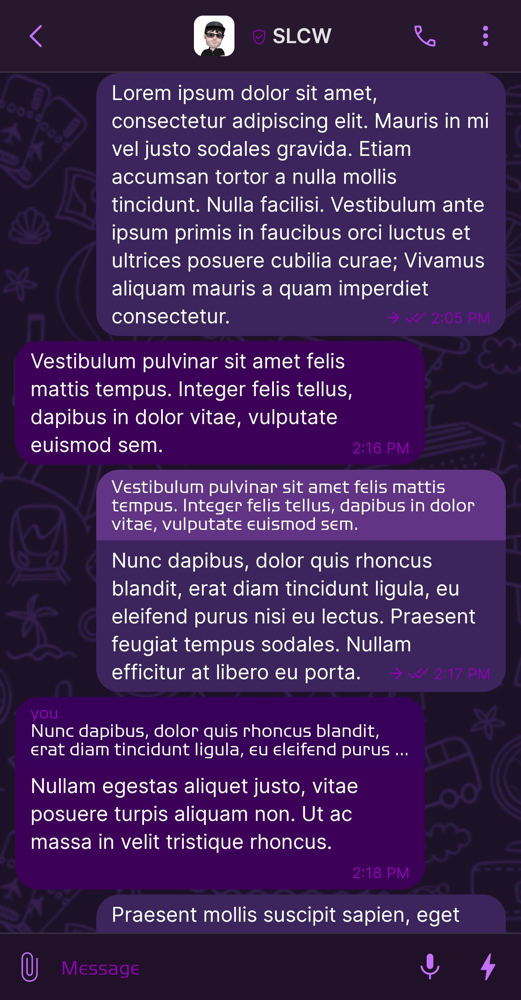
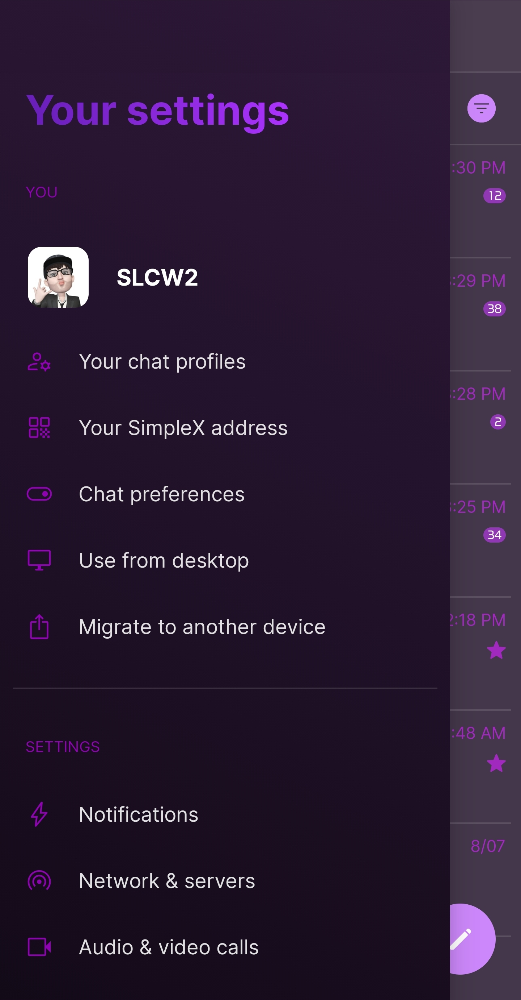
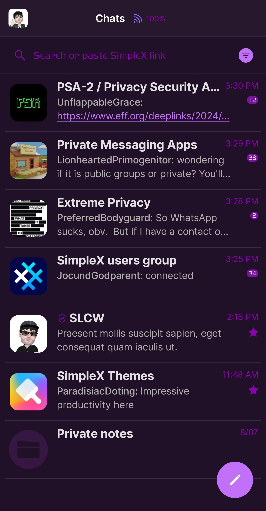
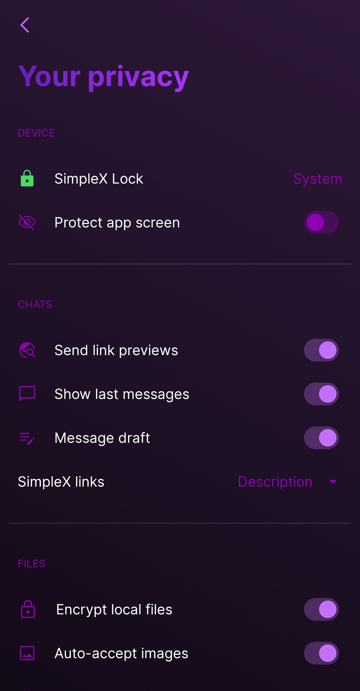

# Purple

* Download [Purple](../themes/SxC_purple.theme)

<a href="../screenshots/SxC_purple01.jpg" target="_blank">
	
</a>&nbsp;&nbsp;&nbsp;
<a href="../screenshots/SxC_purple02.jpg" target="_blank">
	
</a>
<br>
<a href="../screenshots/SxC_purple03.jpg" target="_blank">
	
</a>&nbsp;&nbsp;&nbsp;
<a href="../screenshots/SxC_purple04.jpg" target="_blank">
	
</a>

----
### Theme Properties
```
base: "SIMPLEX"
colors:
  accent: "#ffc270f9"
  accentVariant: "#ff7b12a5"
  secondary: "#ff8f00b2"
  secondaryVariant: "#ff452c4d"
  background: "#ff201128"
  menus: "#ff271237"
  title: "#ff8026e5"
  accentVariant2: "#ff351741"
  sentMessage: "#ff3c255d"
  sentReply: "#ff623485"
  receivedMessage: "#ff3d0059"
  receivedReply: "#ff370059"
wallpaper:
  preset: "travel"
  scale: 2.0
  background: "#ff1d1128"
  tint: "#ff35204e"
```

* [Return Home](../)