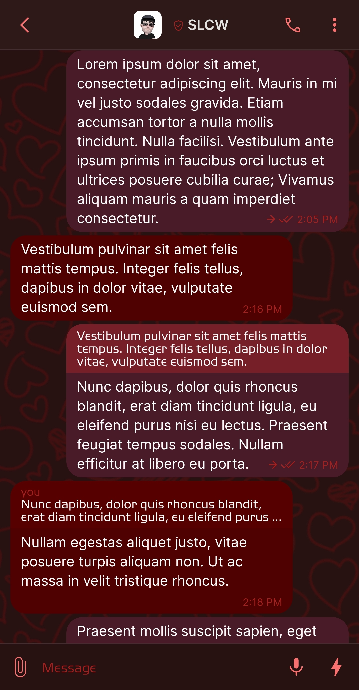
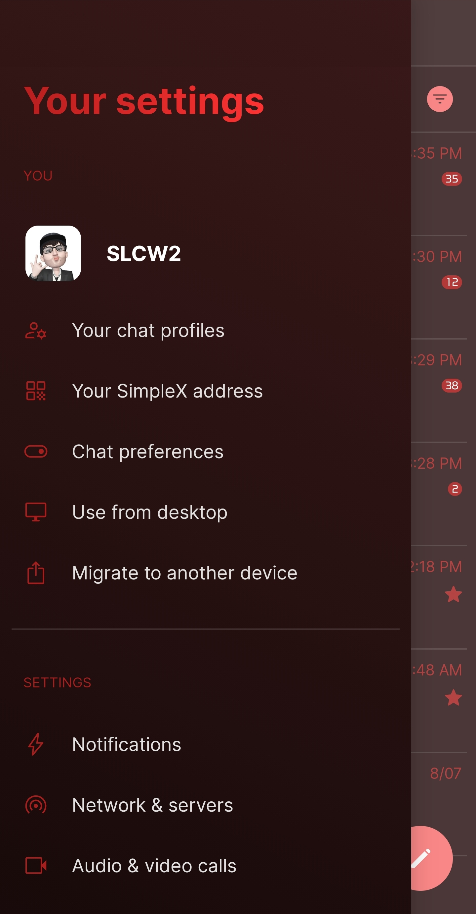
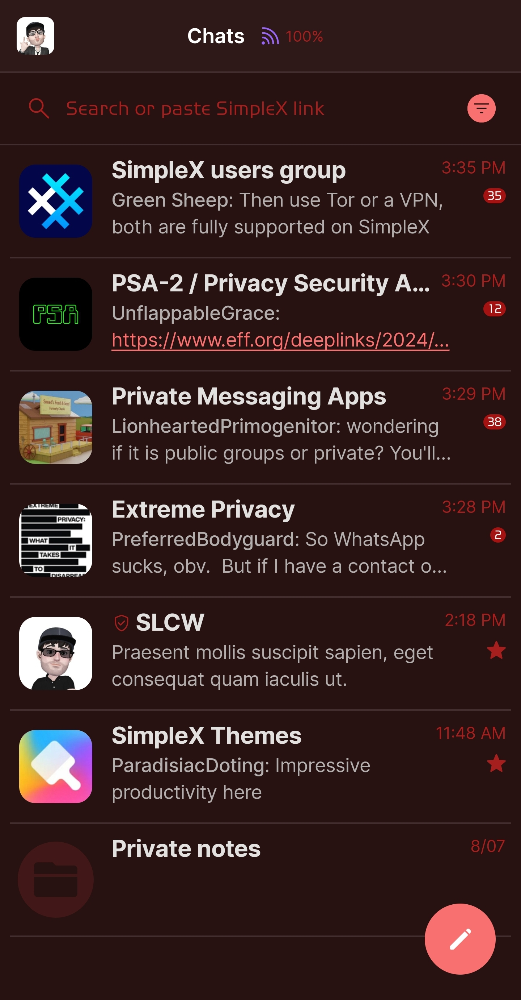
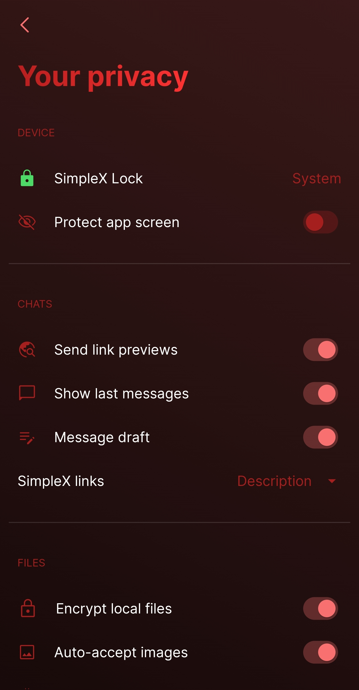

# Red

* Download [Red](../themes/SxC_red.theme)

<a href="../screenshots/SxC_red01.jpg" target="_blank">
	
</a>&nbsp;&nbsp;&nbsp;
<a href="../screenshots/SxC_red02.jpg" target="_blank">
	
</a>
<br>
<a href="../screenshots/SxC_red03.jpg" target="_blank">
	
</a>&nbsp;&nbsp;&nbsp;
<a href="../screenshots/SxC_red04.jpg" target="_blank">
	
</a>

----
### Theme Properties
```
base: "SIMPLEX"
colors:
  accent: "#fff97070"
  accentVariant: "#ffa51212"
  secondary: "#ffa61f1f"
  secondaryVariant: "#ff4d2c2c"
  background: "#ff281111"
  menus: "#ff371212"
  title: "#ffe52626"
  accentVariant2: "#ff411717"
  sentMessage: "#ff491a28"
  sentReply: "#ff761f29"
  receivedMessage: "#ff4f0000"
  receivedReply: "#ff570000"
wallpaper:
  preset: "hearts"
  scale: 2.0
  background: "#ff281111"
  tint: "#ff411010"
```

* [Return Home](../)