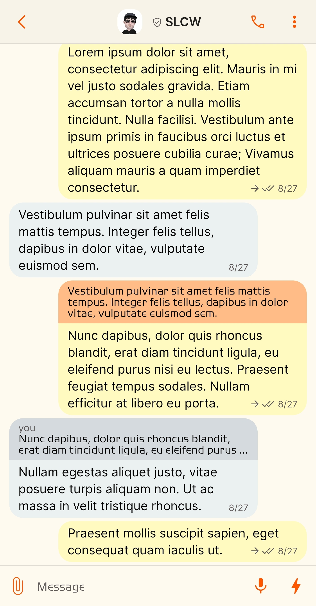
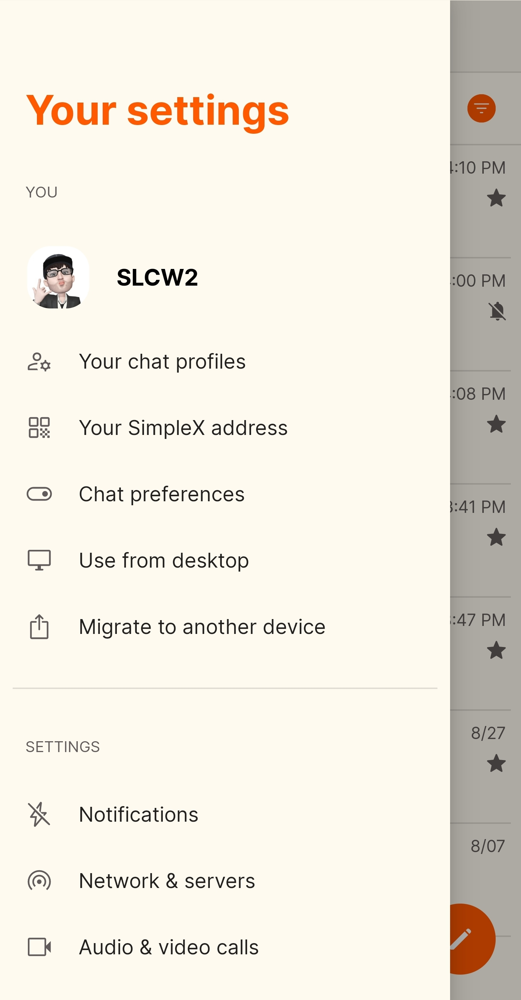
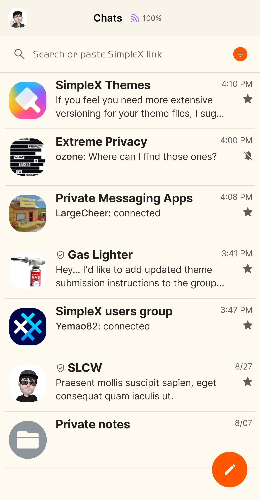
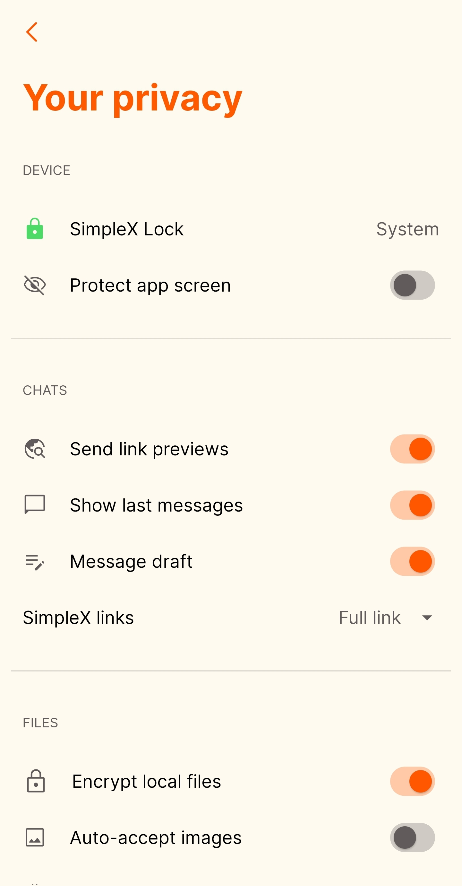

# Sandy Symphony v2

* Download [Sandy Symphony v2](../themes/SxC_sandySymphony-v2.theme)

<a href="../screenshots/SxC_sandySymphony-v201.jpg" target="_blank">
		
</a>&nbsp;&nbsp;&nbsp;
<a href="../screenshots/SxC_sandySymphony-v202.jpg" target="_blank">
		
</a>
<br>
<a href="../screenshots/SxC_sandySymphony-v203.jpg" target="_blank">
		
</a>&nbsp;&nbsp;&nbsp;
<a href="../screenshots/SxC_sandySymphony-v204.jpg" target="_blank">
		
</a>

----
### Theme Properties
```
base: "LIGHT"
colors:
  accent: "#ffff5700"
  accentVariant: "#fffff672"
  secondary: "#ff615b5b"
  secondaryVariant: "#ffbbbcc1"
  background: "#fffffaf0"
  menus: "#ffffffff"
  title: "#ffff5a00"
  accentVariant2: "#ff8b959a"
  sentMessage: "#fffffbc0"
  sentReply: "#ffffbc86"
  receivedMessage: "#ffebf0f0"
  receivedReply: "#ffd4dadd"
```

* [Return Home](../)