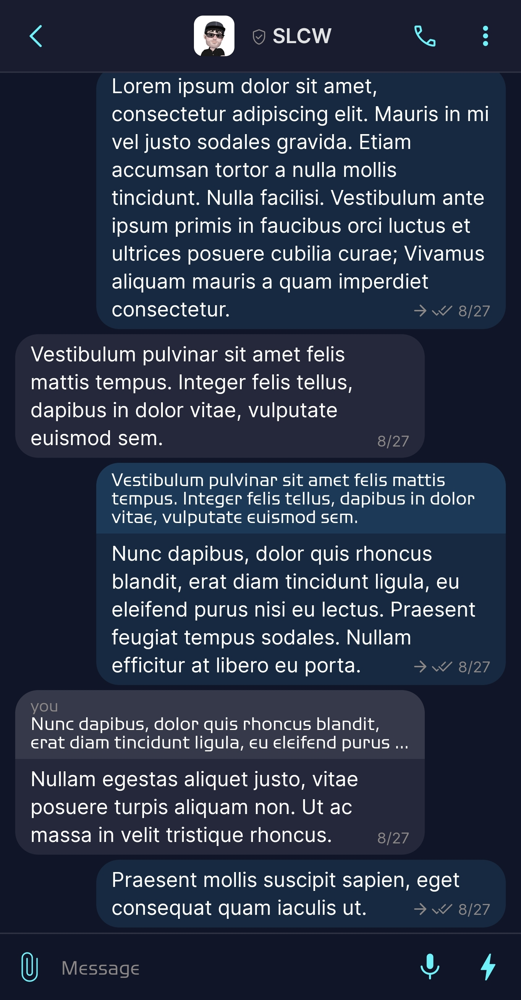
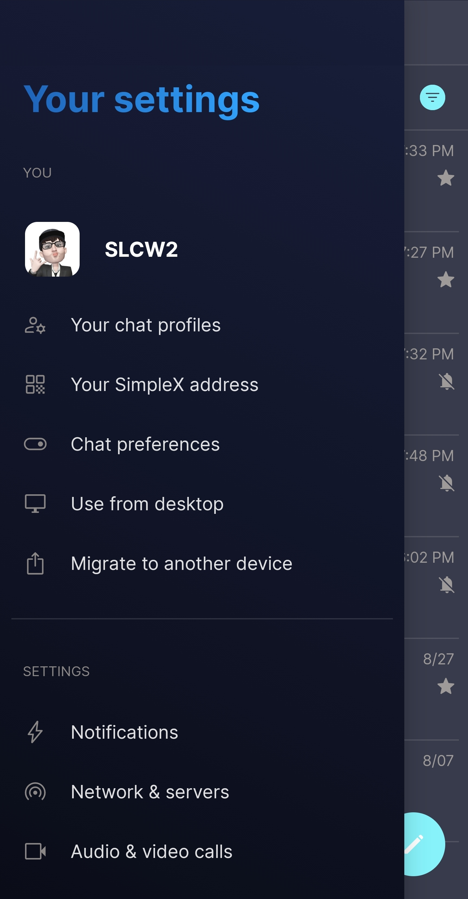
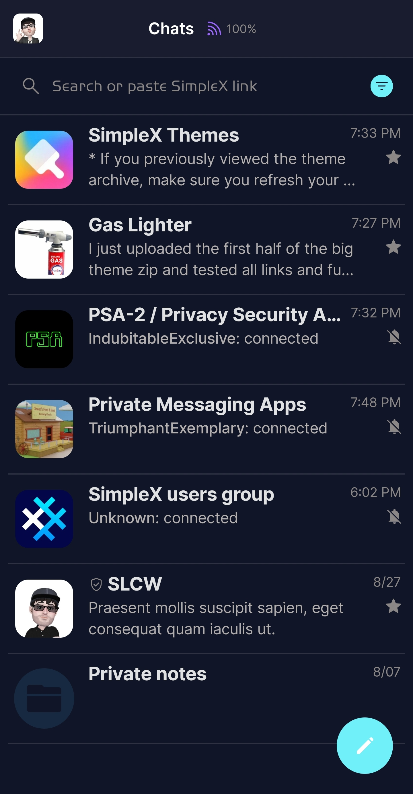
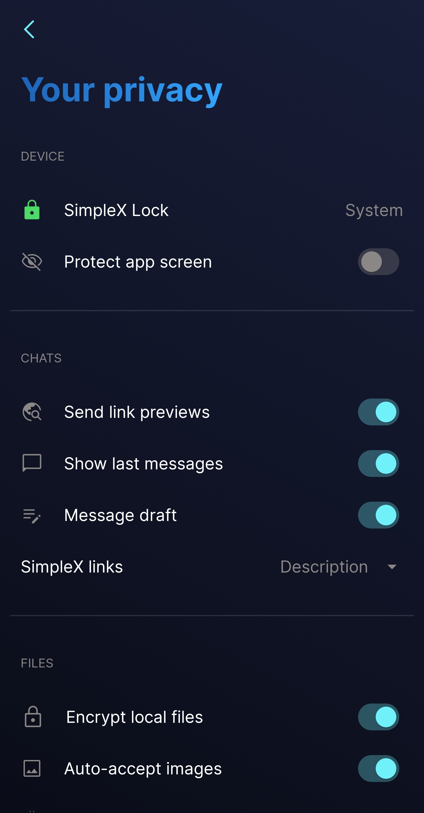

# SimpleX Default

* Download [SimpleX Default](../themes/SxC_simplexDefault.theme)

<a href="../screenshots/SxC_simplexDefault01.jpg" target="_blank">
	
</a>&nbsp;&nbsp;&nbsp;
<a href="../screenshots/SxC_simplexDefault02.jpg" target="_blank">
	
</a>
<br>
<a href="../screenshots/SxC_simplexDefault03.jpg" target="_blank">
	
</a>&nbsp;&nbsp;&nbsp;
<a href="../screenshots/SxC_simplexDefault04.jpg" target="_blank">
	
</a>

----
### Theme Properties
```
base: "SIMPLEX"
colors:
  accent: "#ff70f0f9"
  accentVariant: "#ff1298a5"
  secondary: "#ff8b8786"
  secondaryVariant: "#ff2c464d"
  background: "#ff111528"
  menus: "#ff121c37"
  title: "#ff267be5"
  sentMessage: "#1e45b8ff"
  receivedMessage: "#20b1b0b5"
```

* [Return Home](../)