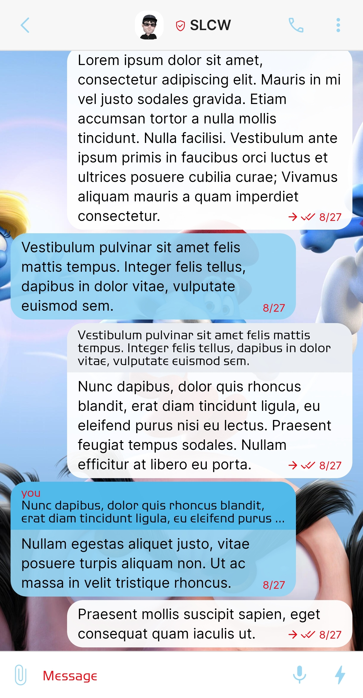
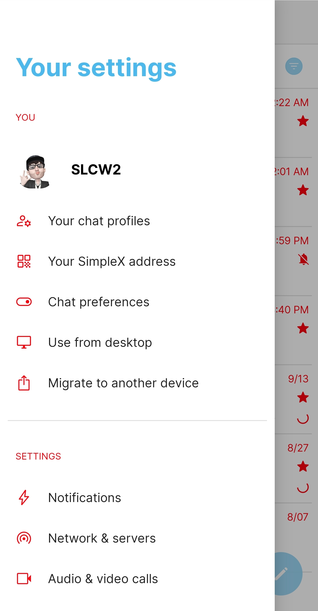
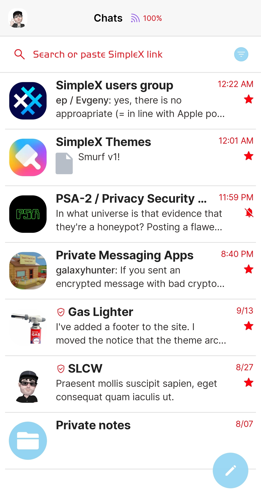
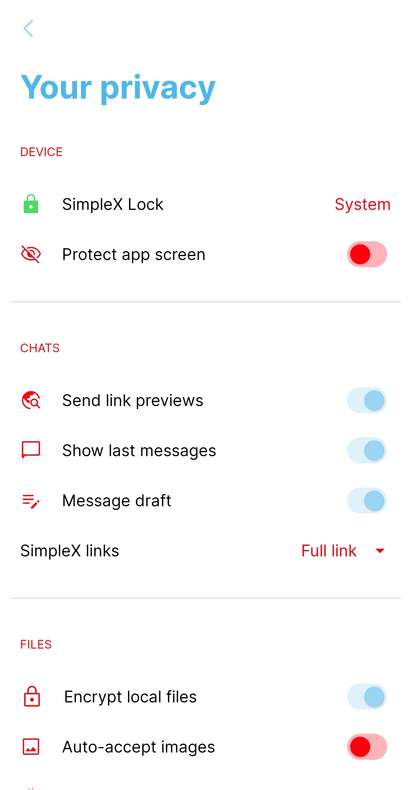

# Smurf 

* Download [Smurf](../themes/SxC_smurf.theme)

<a href="../screenshots/SxC_smurf01.jpg" target="_blank">
		
</a>&nbsp;&nbsp;&nbsp;
<a href="../screenshots/SxC_smurf02.jpg" target="_blank">
		
</a>
<br>
<a href="../screenshots/SxC_smurf03.jpg" target="_blank">
		
</a>&nbsp;&nbsp;&nbsp;
<a href="../screenshots/SxC_smurf04.jpg" target="_blank">
		
</a>

----
### Theme Properties
```
base: "LIGHT"
colors:
  accent: "#ed94d4f3"
  accentVariant: "#ff4cb8eb"
  secondary: "#ffff000f"
  secondaryVariant: "#fffcf51f"
  background: "#ffffffff"
  menus: "#ffff000f"
  title: "#ff4cb8eb"
  accentVariant2: "#ff94d4f3"
  sentMessage: "#eeffffff"
  sentReply: "#eee8edf2"
  receivedMessage: "#ed94d4f3"
  receivedReply: "#ee4cb8eb"
wallpaper:
  scale: 1.0
  scaleType: "fill"
  background: "#ffffffff"
  tint: "#00ffffff"
```

* [Return Home](../)