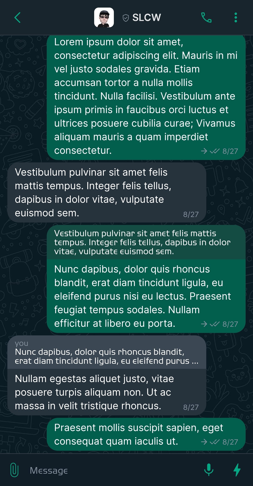
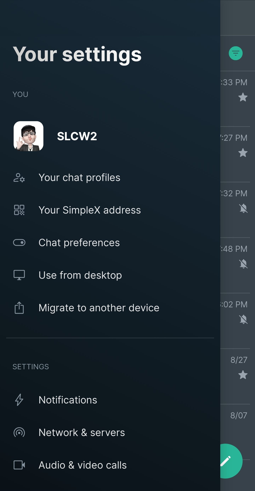
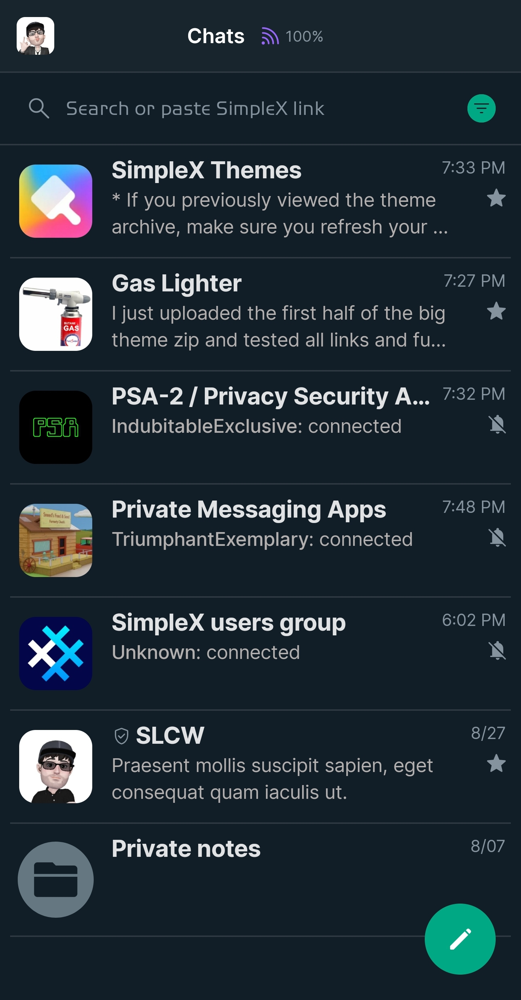
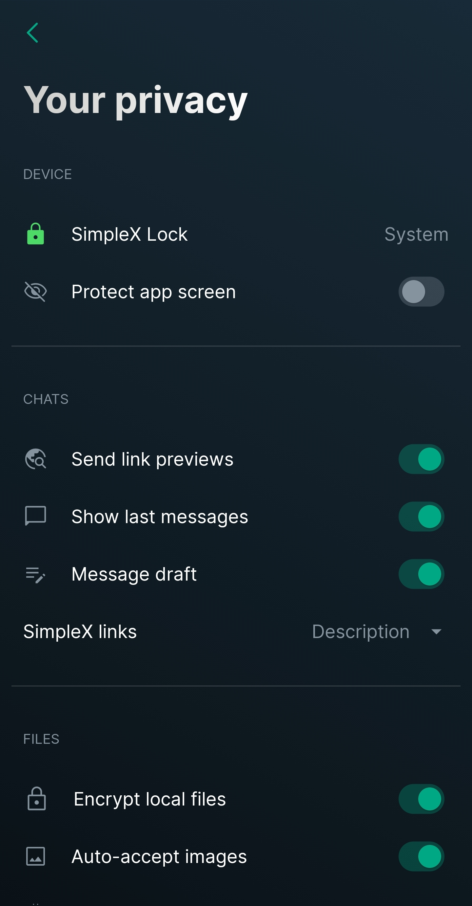

# WhatsApp Dark

* Download [WhatsApp Dark](../themes/SxC_whatsappDark.theme)

<a href="../screenshots/SxC_whatsappDark01.jpg" target="_blank">
	
</a>&nbsp;&nbsp;&nbsp;
<a href="../screenshots/SxC_whatsappDark02.jpg" target="_blank">
	
</a>
<br>
<a href="../screenshots/SxC_whatsappDark03.jpg" target="_blank">
	
</a>&nbsp;&nbsp;&nbsp;
<a href="../screenshots/SxC_whatsappDark04.jpg" target="_blank">
	
</a>

----
### Theme Properties
```
base: "SIMPLEX"
colors:
  accent: "#ff00a884"
  accentVariant: "#ff1298a5"
  secondary: "#ff85939e"
  secondaryVariant: "#ff657781"
  background: "#ff111e27"
  menus: "#ff313244"
  title: "#fffefefb"
  accentVariant2: "#ff657781"
  sentMessage: "#ff025f4e"
  sentReply: "#ff144c44"
  receivedMessage: "#ff26333c"
  receivedReply: "#20cdd6f4"
wallpaper:
  scale: 1.0
  scaleType: "fill"
  background: "#ff1e1e2e"
  tint: "#00ffffff"
```

* [Return Home](../)