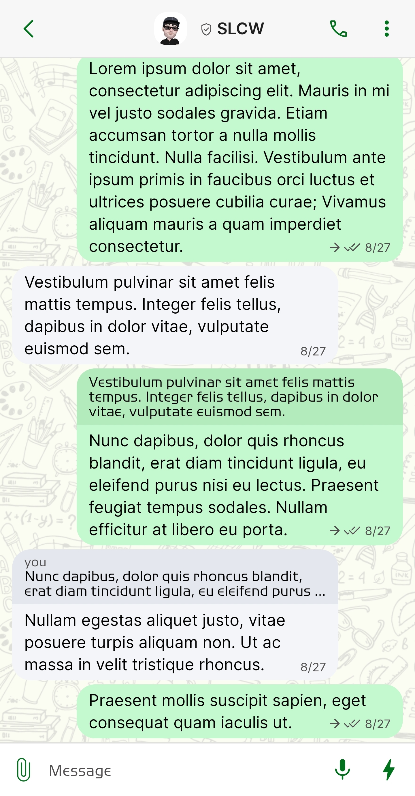
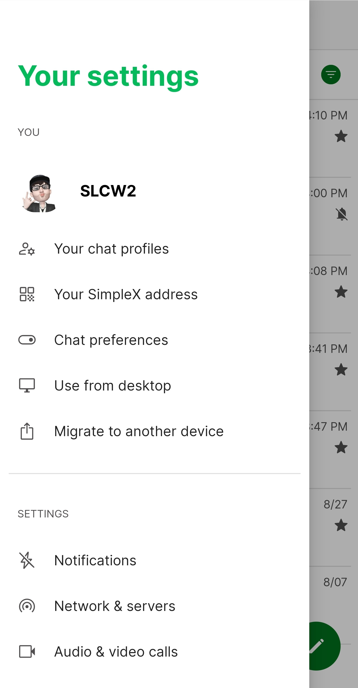
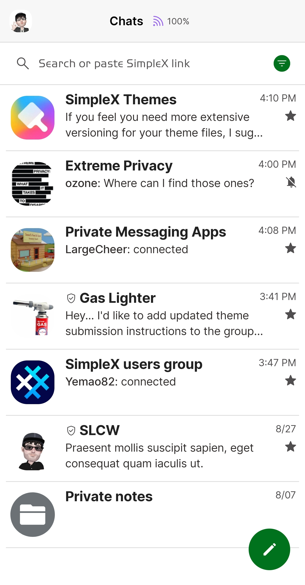
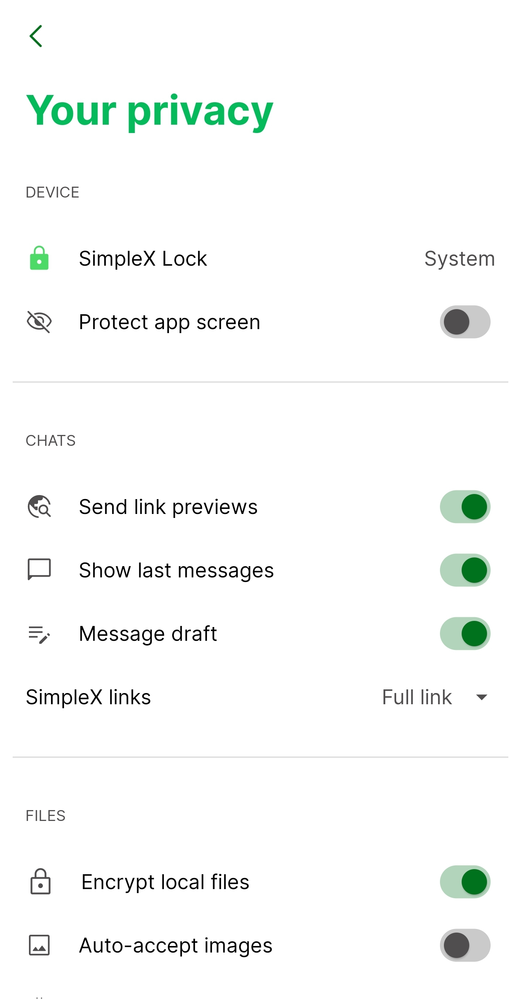

# WhatsApp Green v1

* Download [WhatsApp Green v1](../themes/SxC_whatsappGreen-v1.theme)

<a href="../screenshots/SxC_whatsappGreen-v101.jpg" target="_blank">
		
</a>&nbsp;&nbsp;&nbsp;
<a href="../screenshots/SxC_whatsappGreen-v102.jpg" target="_blank">
		
</a>
<br>
<a href="../screenshots/SxC_whatsappGreen-v103.jpg" target="_blank">
		
</a>&nbsp;&nbsp;&nbsp;
<a href="../screenshots/SxC_whatsappGreen-v104.jpg" target="_blank">
		
</a>

----
### Theme Properties
```
base: "LIGHT"
colors:
  accent: "#ff00721d"
  accentVariant: "#ffdbfadc"
  secondary: "#ff504e4e"
  secondaryVariant: "#ff4e4e4f"
  background: "#ffffffff"
  menus: "#ffe2e3e4"
  title: "#ff04ba5b"
  accentVariant2: "#ff6b7175"
  sentMessage: "#ffc4f8ce"
  sentReply: "#ffb4ebbd"
  receivedMessage: "#fff3f5f9"
  receivedReply: "#ffe4e8ee"
wallpaper:
  preset: "school"
  scale: 1.0052183
  background: "#fffbfcf2"
  tint: "#ffdedfd9"
```

* [Return Home](../)