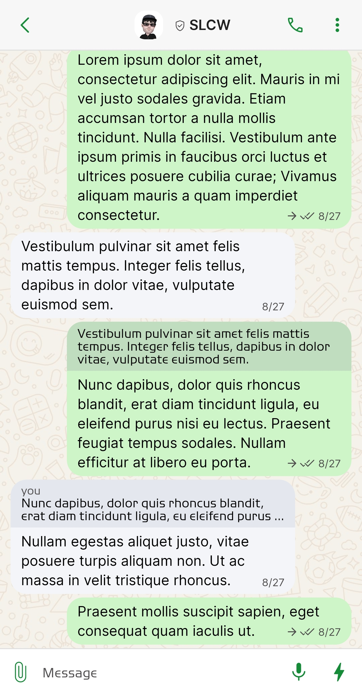
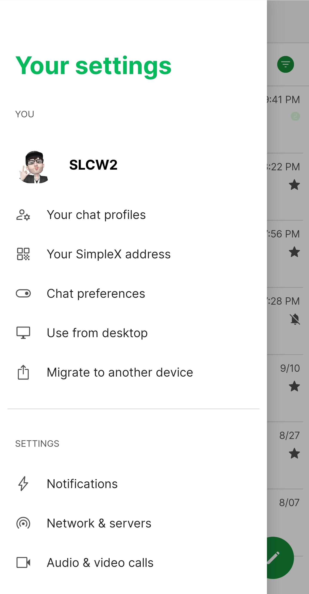
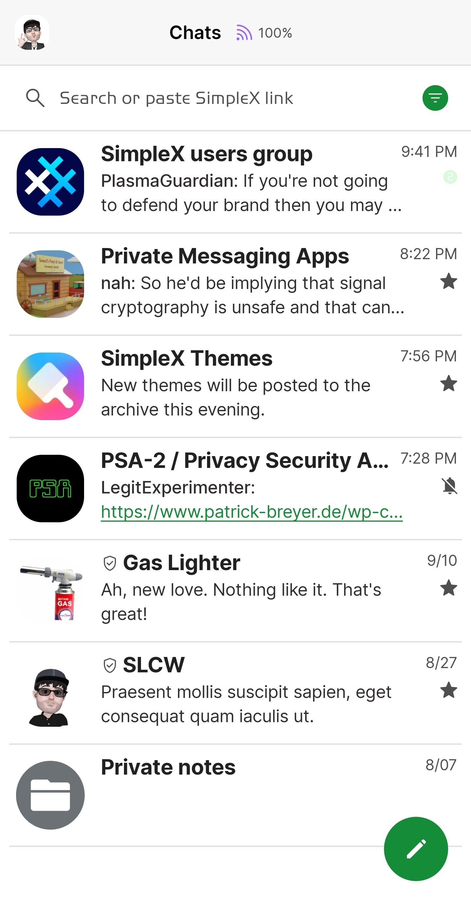
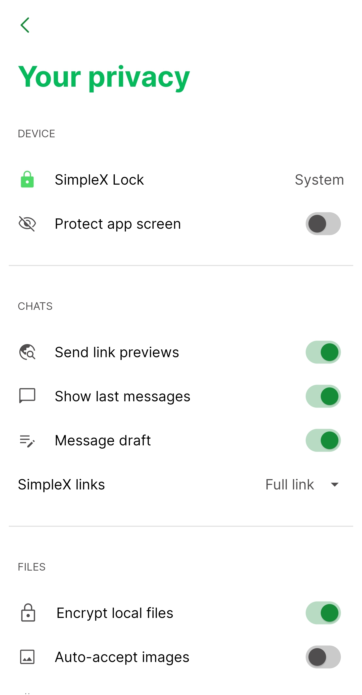

# WhatsApp Light v3

* Download [WhatsApp Light v3](../themes/SxC_whatsappLight-v3.theme)

<a href="../screenshots/SxC_whatsappLight-v301.jpg" target="_blank">
		
</a>&nbsp;&nbsp;&nbsp;
<a href="../screenshots/SxC_whatsappLight-v302.jpg" target="_blank">
		
</a>
<br>
<a href="../screenshots/SxC_whatsappLight-v303.jpg" target="_blank">
		
</a>&nbsp;&nbsp;&nbsp;
<a href="../screenshots/SxC_whatsappLight-v304.jpg" target="_blank">
		
</a>

----
### Theme Properties
```
base: "LIGHT"
colors:
  accent: "#ff148c38"
  accentVariant: "#ffdbfadc"
  secondary: "#ff504e4e"
  secondaryVariant: "#ff4e4e4f"
  background: "#ffffffff"
  menus: "#fff0f2f5"
  title: "#ff04ba5b"
  accentVariant2: "#ff6b7175"
  sentMessage: "#ffcdf5c8"
  sentReply: "#ffc1ddc0"
  receivedMessage: "#fff3f5f9"
  receivedReply: "#ffe4e8ee"
wallpaper:
  scale: 1.0
  scaleType: "fill"
  background: "#ffffffff"
  tint: "#00ffffff"
```

* [Return Home](../)