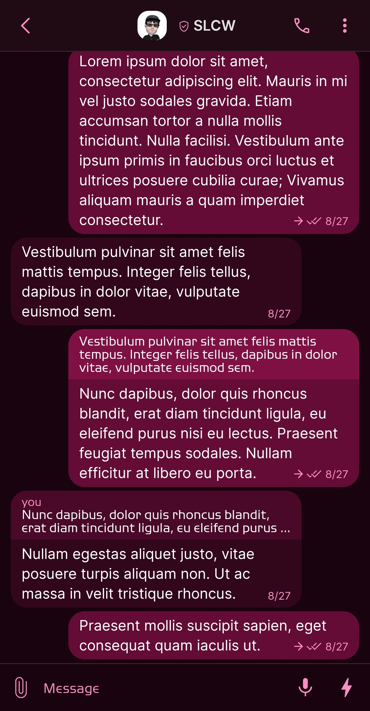
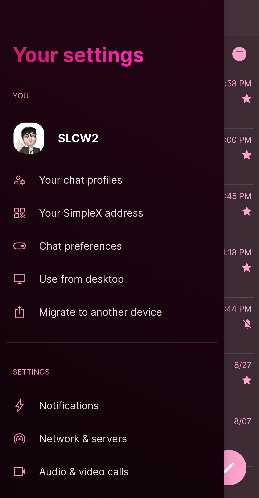
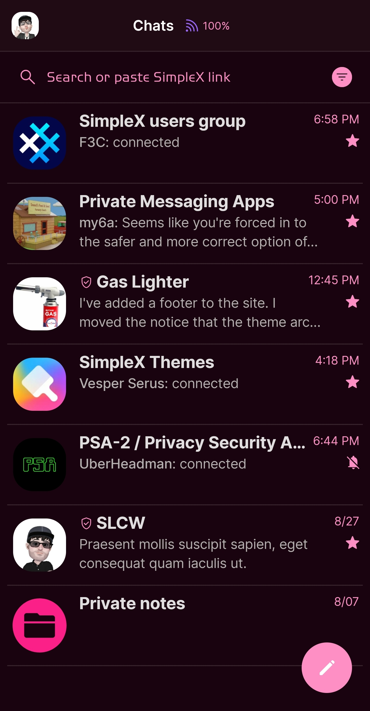
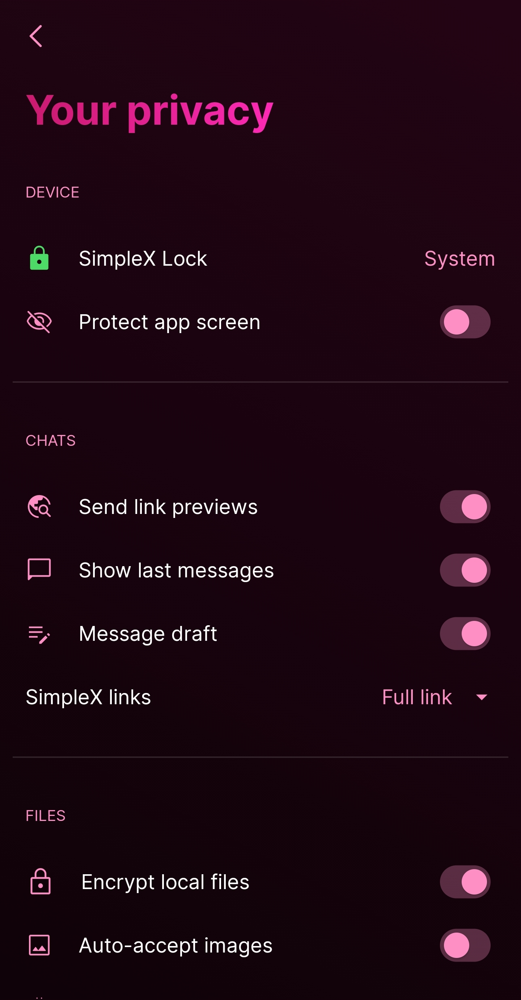

# Xochitl

* Download [Xochitl](../themes/SxC_xochitl.theme)

<a href="../screenshots/SxC_xochitl01.jpg" target="_blank">
		
</a>&nbsp;&nbsp;&nbsp;
<a href="../screenshots/SxC_xochitl02.jpg" target="_blank">
		
</a>
<br>
<a href="../screenshots/SxC_xochitl03.jpg" target="_blank">
		
</a>&nbsp;&nbsp;&nbsp;
<a href="../screenshots/SxC_xochitl04.jpg" target="_blank">
		
</a>

----
### Theme Properties
```
base: "SIMPLEX"
colors:
  accent: "#fffd8fc4"
  accentVariant: "#fffb1f88"
  secondary: "#fffd8fc4"
  secondaryVariant: "#ff4401e7"
  background: "#ff19030e"
  menus: "#ff4401e7"
  title: "#fffb1f88"
  accentVariant2: "#fffb1f88"
  sentMessage: "#ff640c36"
  sentReply: "#ff7e1044"
  receivedMessage: "#ff32061b"
  receivedReply: "#ff4b0929"
```

* [Return Home](../)