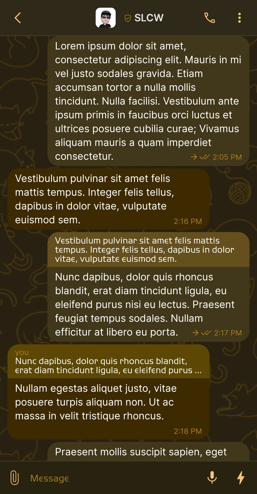
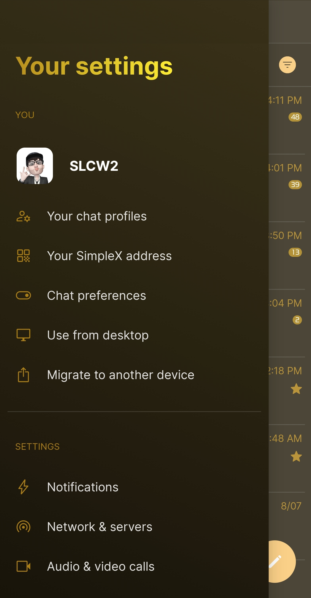
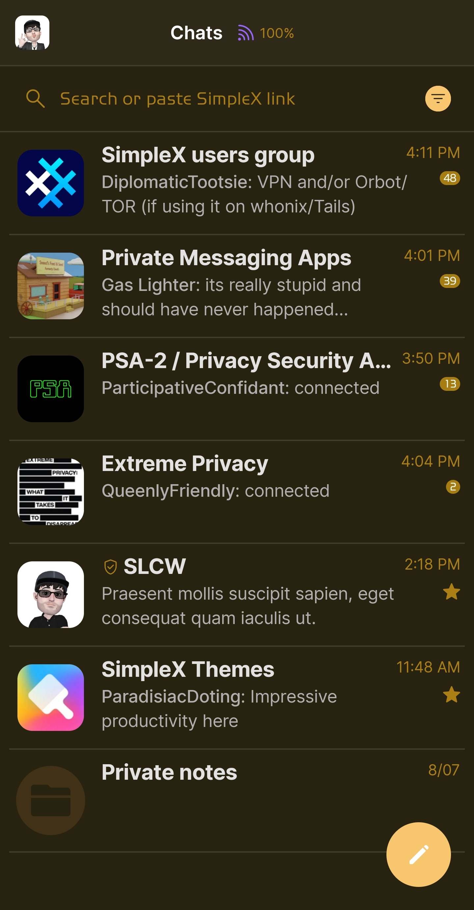
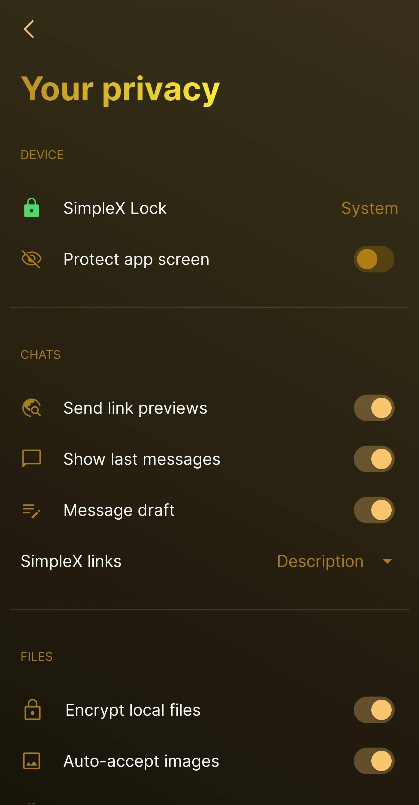

# Yellow

* Download [Yellow](../themes/SxC_yellow.theme)

<a href="../screenshots/SxC_yellow01.jpg" target="_blank">
	
</a>&nbsp;&nbsp;&nbsp;
<a href="../screenshots/SxC_yellow02.jpg" target="_blank">
	
</a>
<br>
<a href="../screenshots/SxC_yellow03.jpg" target="_blank">
	
</a>&nbsp;&nbsp;&nbsp;
<a href="../screenshots/SxC_yellow04.jpg" target="_blank">
	
</a>

----
### Theme Properties
```
base: "SIMPLEX"
colors:
  accent: "#fff9c670"
  accentVariant: "#ffa57d12"
  secondary: "#ffac7f14"
  secondaryVariant: "#ff4d422c"
  background: "#ff282211"
  menus: "#ff372a12"
  title: "#ffe5b126"
  accentVariant2: "#ff413117"
  sentMessage: "#ff41371b"
  sentReply: "#ff654f1c"
  receivedMessage: "#ff3e2a00"
  receivedReply: "#ff5d4704"
wallpaper:
  preset: "cats"
  scale: 2.0
  background: "#ff282011"
  tint: "#ff51400f"
```

* [Return Home](../)